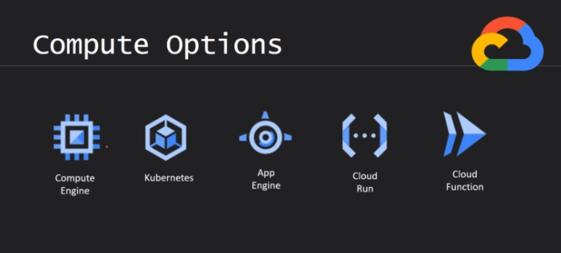

# Docker Image Build

## Build docker image with name & tag 'ubuntu:latest'
docker build -t ubuntu:latest .

## To run image and check changes
docker run -it ce4ef30c343d

## Remove docker image forcefully
docker image rm -f 919e5e8c2ede 3b2d27eee978

## To export Images files & directories to Local
docker build --output type=local,dest=out .
docker build --output type=tar,dest=out.tar .

## Run docker image in detached mode (backgroud)
docker run -d -p 8080:8080 tomcat-img

## To access running Docker container
docker exec -it d12d16d54771 /bin/bash

## Docker push image
docker tag tomcat-img:latest gsk2gg/tomcat-img:latest 

docker push gsk2gg/tomcat-img:latest

# Google Cloud:
### Compute Options
- 1. Compute Engine
    
- 2. Kubernetes
- 3. App Engine
- 4. Cloud Run
- 5. Cloud Function
    - Cloud function is lightweight and suttable for simple micro service

- 2 and 4 will be used for the containerized applications
- 1 General purpose one, here we can install anything & deploy anything
- 3 for the App deployment but completaly server less no need to worry about anything
- 5 for the event, tigger could functions

### Deployment methods:
- 1. Blue/green Deploument
        - clone copy of existing system
- 2. Rolling Deployment
        - for example code is deployed in 4 servers, In rolling deployment new code deployment will be applying in phases ways, in each page deploying new code to one server etc..
- 3. Canary Deployment
        - for example code is deployed in 8 servers, In canary deployment, new code deployment will be applying to smaller group of servers (3 servers out of 8). In this approach smaller unit of customers only will be effected with new changes. If everything is looks good then new code changes are applied to the remaining servers.
- 4. Traffic spliting Deployment
        - small percentage of user will be server new version (ex: 10-20%)
        - if everything is fine, redirect all users to new version
        - traffic spliting can be usedfor A/B Testing

